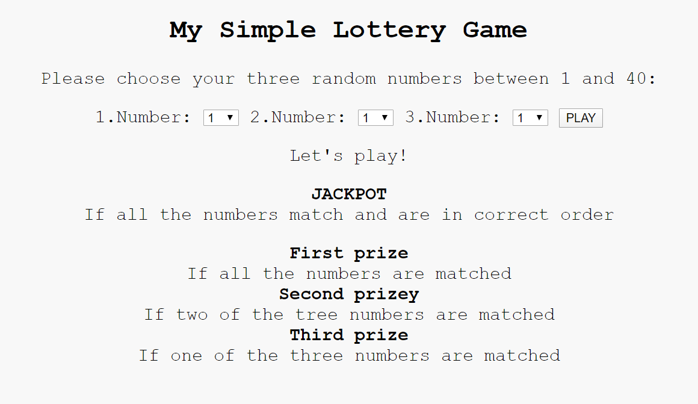
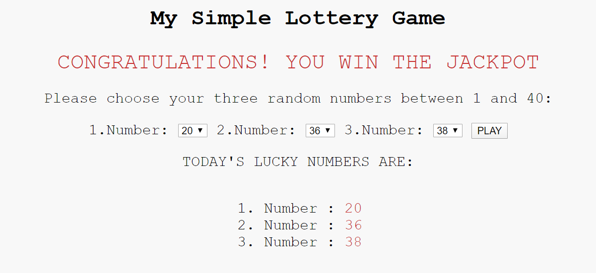

# Lottery Game 

This repository implements a simple lottery game.  Three random integer numbers between 1 and 40 are generated and compared to the user's input.

<b>Can you match all three numbers? Let's see how lucky you are!</b>

The available files:
* index.html: provides thestructure of the page
* game.js: provides the game functionalities
* style.css: style features

To test the application simply clone or download the repository and open the index.html file in any browser.

Enjoy!
